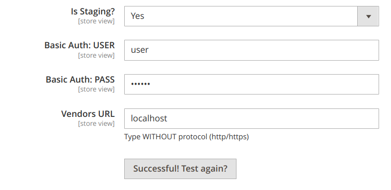

# Overview
This module helps you to add to your stores/configuration section button to check some connection with some system.


# Usage

There are two ways how to use this module. Here is comparison between two possible ways. It's up to you which to use.

| Step                          | Easy and Quick | More Scalable Way | Description                                                                                                      |
|-------------------------------|----------------|--------------------|------------------------------------------------------------------------------------------------------------------|
| Implement an AdapterInterface | +              | +                  | All in all you need to create an Adapter to verify the connection.                                               |
| Create routes.xml             |                | +                  |                                                                                                                  |
| Create controller             |                | +                  | It will be an empty controller extended from original. Further injection will be inside di.xml                   |
| Inject Adapter implementation | +              | +                  | In easy way we use Original block and controller. In second way we use new created controller and virtual block. |
| Use block in config           | +              | +                  | In first way we use original block. In second - virtual.                                                         |

## Easy and quick start.
**Useful for cases when you simply need only one button in your store. And you do not worry about perfect code.**

To add a validation button, you need:

### 1. Implement AdapterInterface.
Implement an interface where you make an attempt to establish a connection with the service you need.

### 2. Inject implementation from the previous step.
Then add your Service Connector (Adapter) to `etc/adminhtml/di.xml`

```xml
<?xml version="1.0"?>
<config xmlns:xsi="http://www.w3.org/2001/XMLSchema-instance" xsi:noNamespaceSchemaLocation="urn:magento:framework:ObjectManager/etc/config.xsd">
    <type name="PerfectCode\ConnectionButton\Block\Adminhtml\System\Config\TestConnection">
        <arguments>
            <argument name="adapter" xsi:type="object">VendorName\ModuleName\Model\Adapter</argument>
        </arguments>
    </type>
    <type name="PerfectCode\ConnectionButton\Controller\Adminhtml\System\Config\Connection">
        <arguments>
            <argument name="adapter" xsi:type="object">VendorName\ModuleName\Model\Adapter</argument>
        </arguments>
    </type>
</config>
```

### 3. Use the block from this module in your config.
Add the button to your `etc/adminhtml/system.xml`
```xml
<field id="test_connect" translate="button_label" sortOrder="50" showInDefault="1" showInWebsite="0" showInStore="0">
    <label/>
    <button_label>Test Connection</button_label>
    <frontend_model>PerfectCode\ConnectionButton\Block\Adminhtml\System\Config\TestConnection</frontend_model>
</field>
```

## Alternative (more dependency inversion principle way)
**According to soli[D] - DIP we need to work with abstractions. 
That's why I would recommend creating your own controller and create your own block.**  

### 1. Implement AdapterInterface.
Implement an interface where you make an attempt to establish a connection with the service you need.

### 2. Create routes configuration.
Create etc/adminhtml/routes.xml
```xml
<?xml version="1.0"?>
<config xmlns:xsi="http://www.w3.org/2001/XMLSchema-instance" xsi:noNamespaceSchemaLocation="urn:magento:framework:App/etc/routes.xsd">
    <router id="admin">
        <route id="validator" frontName="validator">
            <module name="VendorName_ModuleName" />
        </route>
    </router>
</config>
```

### 3. Create your controller and extend from existing.
Your controller can be empty like this one below (we will inject our Adapter through di.xml)
```php
<?php

declare(strict_types=1);

namespace VendorName\ModuleName\Controller\Adminhtml\System\Config;

use PerfectCode\ConnectionButton\Controller\Adminhtml\System\Config\Connection;

class Verify extends Connection
{
}

```

### 4. Inject dependencies using di.xml
This will be almost the same as in 'Easy Way'. The only thing - we will use our own controller.
It's unable to be done via "virtual controller", because magento need its physical persistence. 
More info can be found here: `\Magento\Framework\App\Router\ActionList::validateActionClass`.

We still need to inject our Adapter. Of course this can be done in your PHP class (but in my vision this is more DIP way).

Do not forget to pass your new controller action to the block which is virtual now (module/controller/action).
```xml
<?xml version="1.0"?>
<config xmlns:xsi="http://www.w3.org/2001/XMLSchema-instance" xsi:noNamespaceSchemaLocation="urn:magento:framework:ObjectManager/etc/config.xsd">
    <type name="VendorName\ModuleName\Controller\Adminhtml\System\Config\Verify">
        <arguments>
            <argument name="adapter" xsi:type="object">VendorName\ModuleName\Model\Adapter</argument>
        </arguments>
    </type>
    <virtualType name="SomeServiceConnectionBlock" type="PerfectCode\ConnectionButton\Block\Adminhtml\System\Config\TestConnection">
        <arguments>
            <argument name="adapter" xsi:type="object">VendorName\ModuleName\Model\Adapter</argument>
            <argument name="controllerPath" xsi:type="string">validator/system_config/verify</argument>
        </arguments>
    </virtualType>
</config>
```

### 5. Use our virtual block in configuration.
Add the button to your `etc/adminhtml/system.xml`
Pay attention. Not real but virtual block.
```xml
<field id="test_connect" translate="button_label" sortOrder="50" showInDefault="1" showInWebsite="0" showInStore="0">
    <label/>
    <button_label>Test Connection</button_label>
    <frontend_model>SomeServiceConnectionBlock</frontend_model>
</field>
```
